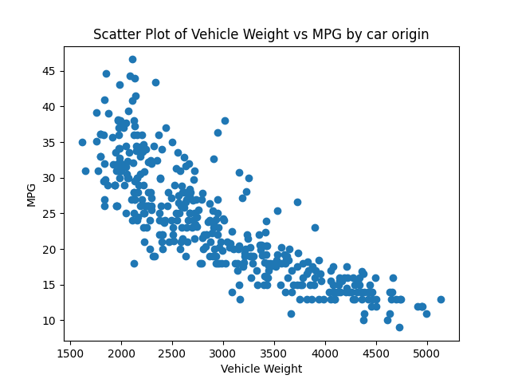

## This is a workflow for a python script which performs descriptive statistics on a csv file
### This project has the following dependencies:
* ruff == 0.0.278
* pytest == 7.4.2
* black == 23.7.0
* pandas == 2.0.3
* nbval == 0.10.0
* matplotlib == 3.7.2

### This project uses has functions defined in a lib.py for reading a csv and generating summary statistics (with appropriate error handling) and a script with associated jupyter notebook for visualizing that data.

### This workflow will perform the following actions on any push to a branch in this repository:
* Establish a virtual environment for python3
* Install the dependencies listed above
* Lint the pushed code with ruff
* Format with black
* (a test has yet to be implemented)

### Below is the output from the script/jupyter notebook which gives the count,mean,std,min, quartiles, and max for each variable:
|       |      mpg |   cylinders |   displacement |   weight |   acceleration |    year |     origin |
|:------|---------:|------------:|---------------:|---------:|---------------:|--------:|-----------:|
| count | 397      |   397       |        397     |  397     |       397      | 397     | 397        |
| mean  |  23.5159 |     5.45844 |        193.533 | 2970.26  |        15.5557 |  75.995 |   1.57431  |
| std   |   7.8258 |     1.70158 |        104.38  |  847.904 |         2.75   |   3.69  |   0.802549 |
| min   |   9      |     3       |         68     | 1613     |         8      |  70     |   1        |
| 25%   |  17.5    |     4       |        104     | 2223     |        13.8    |  73     |   1        |
| 50%   |  23      |     4       |        146     | 2800     |        15.5    |  76     |   1        |
| 75%   |  29      |     8       |        262     | 3609     |        17.1    |  79     |   2        |
| max   |  46.6    |     8       |        455     | 5140     |        24.8    |  82     |   3        |

### Below is the result of the visualize function from the script which plots vehicle weight against mpg.

### This is the front end of a potential CD pipeline which will quality control continuously developed code into a deployment environment. Future iterations will build on this baseline best practice and scale into projects of higher complexity.

