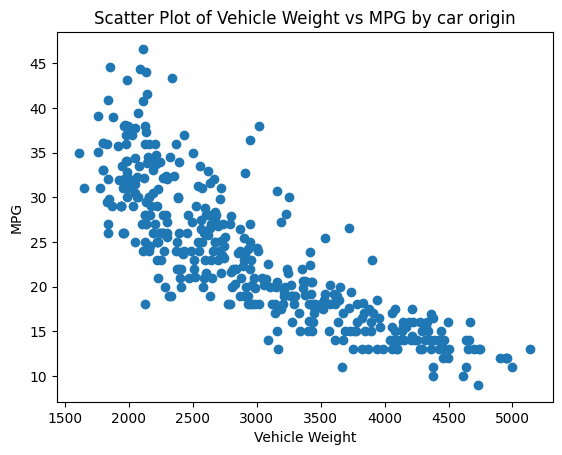

## This is a workflow for a python script which performs descriptive statistics on a csv file
### This project has the following dependencies:
* ruff == 0.0.278
* pytest == 7.4.2
* black == 23.7.0
* pandas == 2.0.3
* nbval == 0.10.0
* matplotlib == 3.7.2

### This project uses has functions defined in a lib.py for reading a csv and generating summary statistics (with appropriate error handling) and a script with associated jupyter notebook for visualizing that data.

### This workflow will perform the following actions on any push to a branch in this repository:
* Establish a virtual environment for python3
* Install the dependencies listed above
* Lint the pushed code with ruff
* Format with black
* (a test has yet to be implemented)

### Below is the output from the script/jupyter notebook which gives the count,mean,std,min, quartiles, and max for each variable:
              mpg   cylinders  displacement       weight  acceleration  \
count  397.000000  397.000000    397.000000   397.000000    397.000000   
mean    23.515869    5.458438    193.532746  2970.261965     15.555668   
std      7.825804    1.701577    104.379583   847.904119      2.749995   
min      9.000000    3.000000     68.000000  1613.000000      8.000000   
25%     17.500000    4.000000    104.000000  2223.000000     13.800000   
50%     23.000000    4.000000    146.000000  2800.000000     15.500000   
75%     29.000000    8.000000    262.000000  3609.000000     17.100000   
max     46.600000    8.000000    455.000000  5140.000000     24.800000   

             year      origin  
count  397.000000  397.000000  
mean    75.994962    1.574307  
std      3.690005    0.802549  
min     70.000000    1.000000  
25%     73.000000    1.000000  
50%     76.000000    1.000000  
75%     79.000000    2.000000  
max     82.000000    3.000000  

### Below is the result of the visualize function from the script which plots vehicle weight against mpg.

### This is the front end of a potential CD pipeline which will quality control continuously developed code into a deployment environment. Future iterations will build on this baseline best practice and scale into projects of higher complexity.

